# Productled

<H3 align="center"><strong>An open-source Product-led Growth (PLG) platform</strong></H3>

Enabling products to thrive in AARRR Pirate Metrics (Acquisition, Activation, Revenue, Retention and Referrals)

 

<a href="https://productled.github.io">Website</a> 
 · 
<a href="https://productled.github.io">Demo</a> 
 · 
<a href="https://99x.io">by 99x</a> 
  

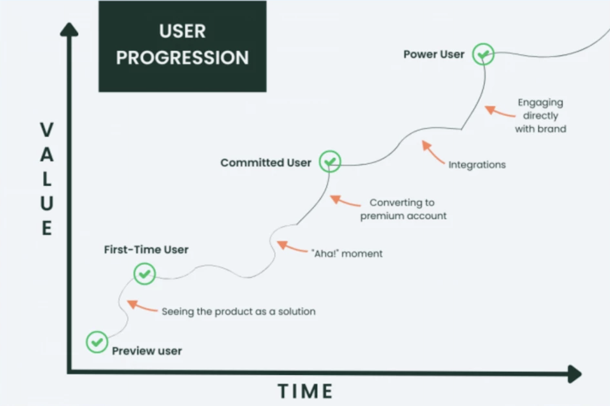
*[figure: How to leverage PLG platform to drive product growth]*

A Product-led Growth (PLG) platform is vital for digital products because it embeds growth directly into the product experience, focusing on leveraging the product itself as the primary driver of customer acquisition, activation, retention, revenue, and referrals. Here’s how such a platform supports digital products across various phases:

## Table of Contents

- [Acquisition Features](#acquisition-features)
- [Activation Features](#activation-features)
- [Retention Features](#retention-features)
- [Revenue Features](#revenue-features)
- [Referrals Features](#referrals-features)

## **Acquisition Features**

By optimizing the first impressions and entry points, the platform ensures new users are smoothly transitioned from prospects to active users. Tools like easy trial initiation and flexible pricing models lower the barrier to entry, increasing the likelihood of adoption.

### Consent Management

Cookie and Privacy Consent UI Components help digital products comply with data privacy regulations by providing users with clear information about data collection and usage. These components typically include cookie banners, consent forms, and privacy policy links, allowing users to make informed decisions about their data. By ensuring transparency and user control over data privacy, this feature builds trust and credibility with users.

Read more about [Consent Management](documents/concent.md).

### Pricing Models

Flexible Pricing Models offer users a range of options to choose from, based on their needs and budget. By providing different pricing tiers, subscription plans, or pay-as-you-go models, this feature caters to a diverse user base, making the product accessible to a wider audience. It helps to convert prospects into paying customers by offering a pricing structure that aligns with their preferences.

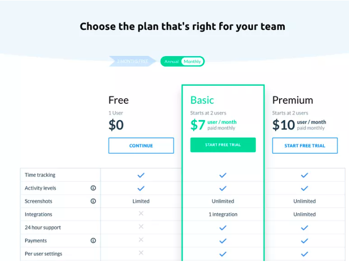

Read more about [Pricing Models](documents/pricing.md).

## **Activation Features**

The platform accelerates user engagement by helping them discover and use the product’s value-driving features swiftly. Features like in-app spotlights, tooltips, and guided checklists shorten the time to value, enhancing user satisfaction and reducing early-stage churn.

### Spotlights

In-app Spotlights are targeted notifications or messages that highlight new features or important areas within the product. These spotlights are designed to be non-intrusive, appearing at the right time and place to draw the user's attention without interrupting their workflow. This feature helps users quickly learn about new functionalities, ensuring they stay informed and engaged.

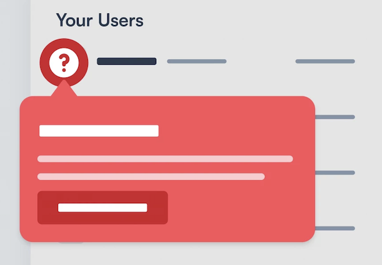

Read more about [Spotlights](documents/spotlights.md).

### Tooltips

Subtle Tooltips provide gentle hints and suggestions as users navigate through the product. These tooltips appear when users hover over or focus on certain elements, encouraging them to explore features independently. Tooltips enhance the user experience by offering contextual information and guidance without being overly directive.

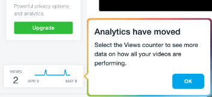

Read more about [Tooltips](documents/tooltips.md).

### Tours

Tour Guides offer step-by-step guidance to help users complete key tasks or workflows within the product. These tours are particularly useful during the onboarding process, as they provide clear instructions and track progress, ensuring users don't miss any important steps. This feature helps users gain confidence and familiarity with the product's capabilities. Tour can be implemented as a series of spotlights, tooltips and announcements.

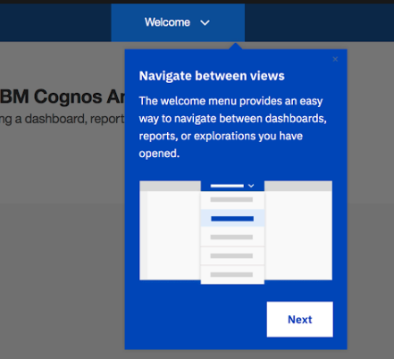

Read more about [Tours](documents/tours.md).

### Checklists

Checklists offer step-by-step guidance to help users complete key tasks or workflows within the product. These checklists are particularly useful during the onboarding process, as they provide clear instructions and track progress, ensuring users don't miss any important steps. This feature helps users gain confidence and familiarity with the product's capabilities.

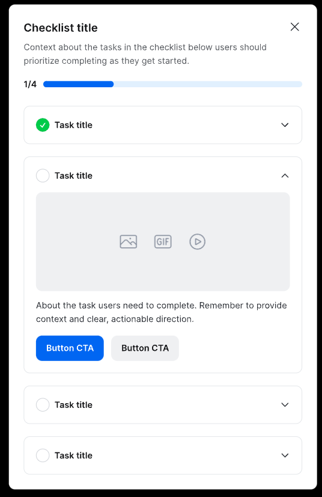

Read more about [Completion Checklists](documents/checklists.md).

### Announcements

Announcement Modals deliver timely and relevant information through pop-up windows, tailored to the user's current context within the product. These modals can be used for announcements, feature introductions, or providing additional context when a user performs certain actions. They are an effective way to communicate important messages without overwhelming the user, keeping them informed and engaged.

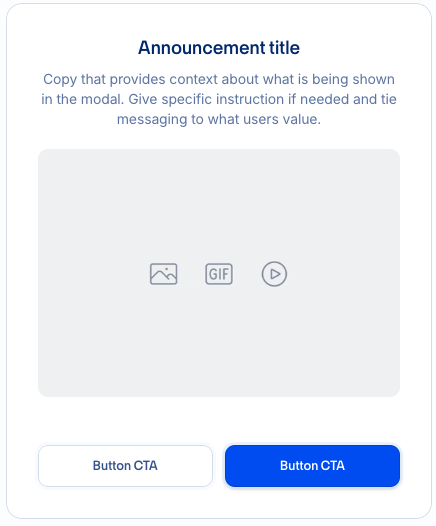

Read more about [Announcements](documents/announcements.md).

## **Retention Features**

Keeping users engaged over the long term is crucial. The retention tools focus on maintaining interest and satisfaction through ongoing interaction, such as in-app feedback systems and loyalty programs, which encourage users to remain active and satisfied.

### Banners

Engaging Banners are eye-catching notifications that appear at the top or bottom of the screen to deliver important messages or updates to users. These banners can be used for announcements, or alerts, providing a visible and persistent way to communicate with users. By capturing attention and driving action, this feature helps to keep users informed, avoid frustrations for example at a scheduled downtime.

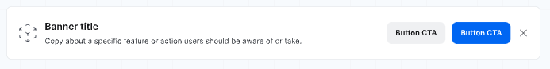

Read more about [Banners](documents/banners.md).

### Feedback

In-app Feedback Forms allow users to share their thoughts, suggestions, and concerns directly within the product. These forms can be triggered at specific points in the user journey or made available through a dedicated feedback button. By collecting user feedback in real-time, this feature helps to identify pain points, gather insights, and improve the overall user experience.

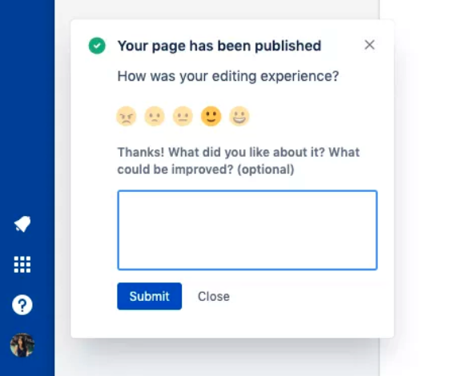

Read more about [Feature Requests](documents/feedback.md).

### Feature Requests

Feature Request Forms enable users to submit ideas, suggestions, or requests for new product features. These forms can be used to gather feedback from users, prioritize feature development, and engage the community in product decisions. By providing a channel for users to share their input, this feature helps to align product development with user needs and preferences.

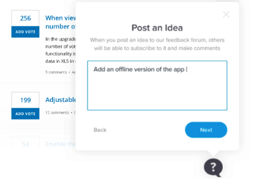

Read more about [Feature Requests](documents/feature-requests.md).

## **Revenue Features**

Monetization strategies are built into the product, encouraging users to upgrade or make additional purchases. Features that promote up-selling, renewals, and targeted discounts help maximize the revenue potential from existing customers, making the product to financially thrive.

### Trial Conversions

If the user is in a trial period, the Trial Status feature provides a clear indication of the remaining time, encouraging users to explore the product and make the most of the trial period. By displaying the trial status prominently, this feature helps users track their progress and motivates them to convert before the trial ends.

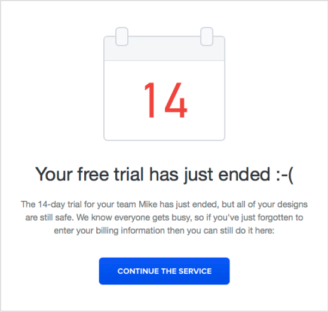

Read more about [Trial Status](documents/trials.md).

### Up-selling

Up-selling Promotions encourage users to upgrade to higher-tier plans or purchase additional features by offering targeted discounts or incentives. By highlighting the value of premium offerings and showcasing the benefits of upgrading, this feature motivates users to explore new options and expand their usage of the product. It helps to increase revenue by driving conversions and maximizing customer lifetime value.

Read more about [Up-selling](documents/up-selling.md).

## **Referrals Features**

By leveraging existing users to gain new ones, the platform utilizes the power of word-of-mouth. Encouraging users to refer others, share reviews, and engage socially with the product can significantly amplify customer acquisition at a low cost.

### User Referrals

User Referral Programs incentivize existing users to refer friends, family, or colleagues to the product. By offering rewards, discounts, or exclusive benefits for successful referrals, this feature encourages users to share their positive experiences and promote the product to their network. It helps to drive customer acquisition, expand the user base, and build a community of brand advocates.

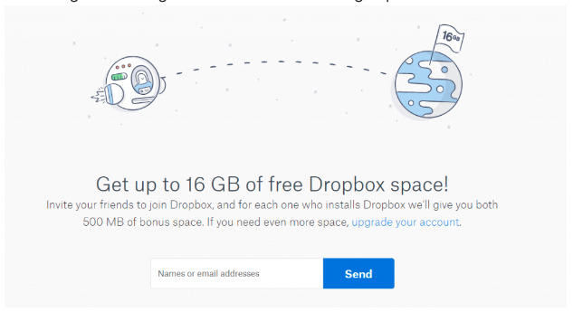

Read more about [Referrals](documents/referrals.md).

### NPS Surveys

Net Promoter Score (NPS) Surveys measure customer loyalty and satisfaction by asking users to rate their likelihood of recommending the product to others. By collecting feedback and insights from users, this feature helps to identify promoters, passives, and detractors, enabling targeted actions to improve customer relationships and drive referrals.

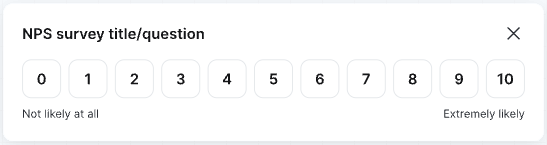

Read more about [NPS](documents/nps.md).

### User Reviews

User Review Platforms enable users to share their feedback, ratings, and testimonials about the product. By providing a platform for user-generated content, this feature helps to build credibility, trust, and social proof among potential customers. User reviews are published on external review sites such as G2, Capterra, Trustpilot, or integrated directly into the product's website.

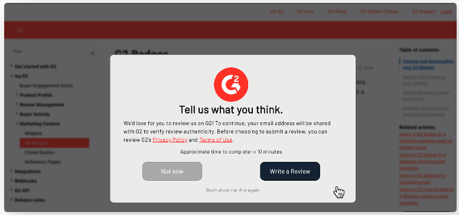

Read more about [User Reviews](documents/reviews.md).
