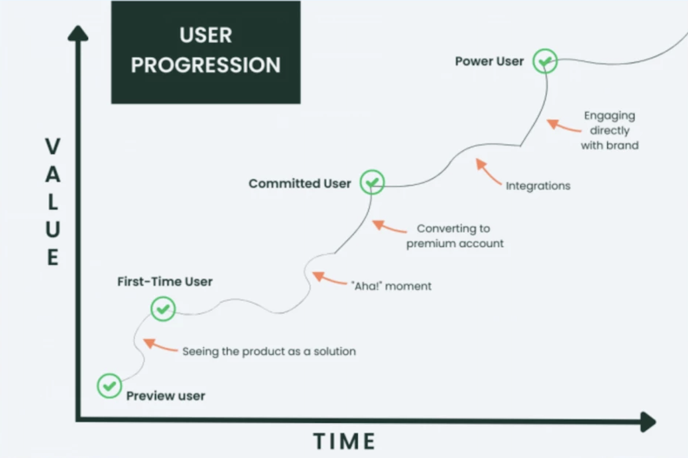
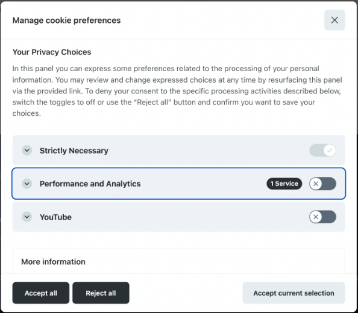
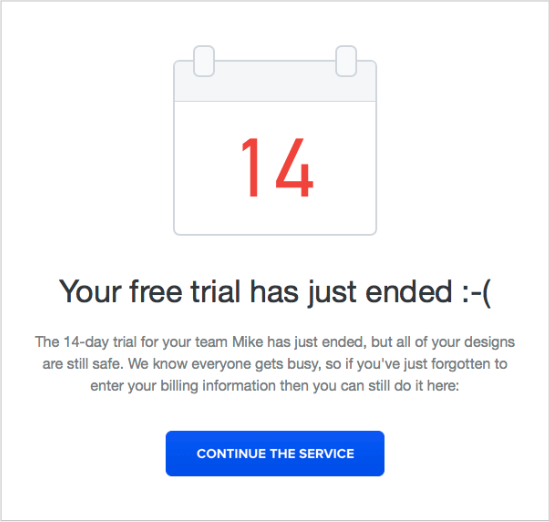
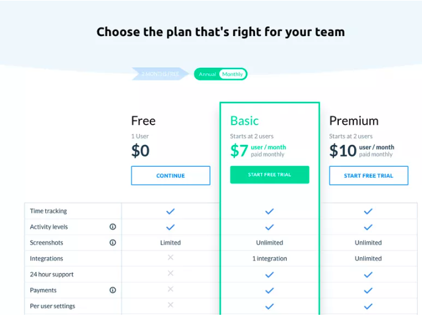
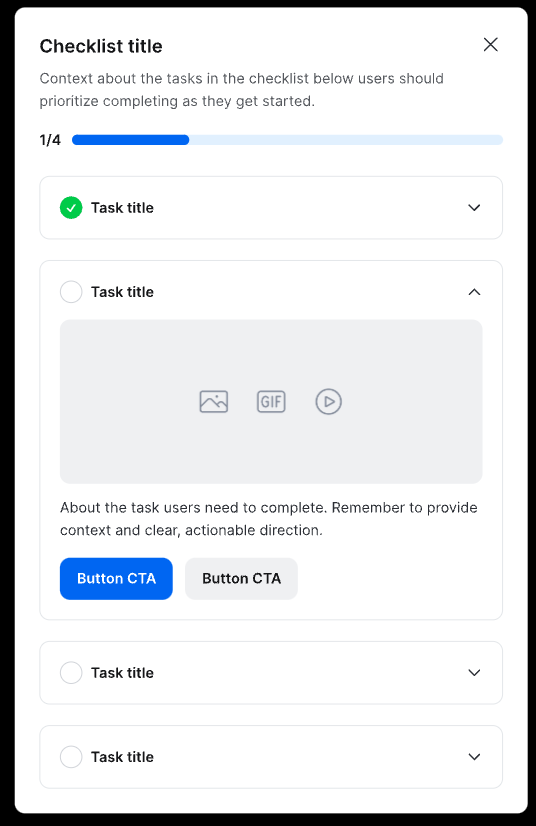
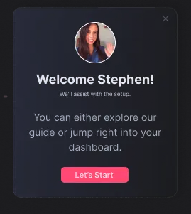

# Productled

<H3 align="center"><strong>An open-source Product-led Growth (PLG) platform</strong></H3>

Enabling products to thrive in AARRR Pirate Metrics (Acquisition, Activation, Revenue, Retention and Referrals)

 

<a href="https://productled.github.io">Website</a> 
 · 
<a href="https://productled.github.io">Demo</a> 
 · 
<a href="https://99x.io">by 99x</a> 
  

*[figure: How to leverage PLG platform to drive product growth]*

A Product-led Growth (PLG) platform is vital for digital products because it embeds growth directly into the product experience, focusing on leveraging the product itself as the primary driver of customer acquisition, activation, retention, revenue, and referrals. Here’s how such a platform supports digital products across various phases:

## Table of Contents
- [Acquisition Features](#acquisition-features)
- [Activation Features](#activation-features)
- [Retention Features](#retention-features)
- [Revenue Features](#revenue-features)
- [Referrals Features](#referrals-features)

## **Acquisition Features**

By optimizing the first impressions and entry points, the platform ensures new users are smoothly transitioned from prospects to active users. Tools like easy trial initiation and flexible pricing models lower the barrier to entry, increasing the likelihood of adoption.

### Consent Management

Cookie and Privacy Consent UI Components help digital products comply with data privacy regulations by providing users with clear information about data collection and usage. These components typically include cookie banners, consent forms, and privacy policy links, allowing users to make informed decisions about their data. By ensuring transparency and user control over data privacy, this feature builds trust and credibility with users.

Read more about [Consent Management](docs/concent.md).

### Trial Status

If the user is in a trial period, the Trial Status feature provides a clear indication of the remaining time, encouraging users to explore the product and make the most of the trial period. By displaying the trial status prominently, this feature helps users track their progress and motivates them to engage with the product before the trial ends.

Read more about [Consent Management](docs/trials.md).

### Pricing Models

Flexible Pricing Models offer users a range of options to choose from, based on their needs and budget. By providing different pricing tiers, subscription plans, or pay-as-you-go models, this feature caters to a diverse user base, making the product accessible to a wider audience. It helps to convert prospects into paying customers by offering a pricing structure that aligns with their preferences.

Read more about [Consent Management](docs/pricing.md).

## **Activation Features**

The platform accelerates user engagement by helping them discover and use the product’s value-driving features swiftly. Features like in-app spotlights, tooltips, and guided checklists shorten the time to value, enhancing user satisfaction and reducing early-stage churn.

### Feature Spotlights

In-app Spotlights are targeted notifications or messages that highlight new features or important areas within the product. These spotlights are designed to be non-intrusive, appearing at the right time and place to draw the user's attention without interrupting their workflow. This feature helps users quickly learn about new functionalities, ensuring they stay informed and engaged.

Read more about [Feature Spotlights](docs/spotlights.md).

### Guiding Tooltips

Subtle Tooltips provide gentle hints and suggestions as users navigate through the product. These tooltips appear when users hover over or focus on certain elements, encouraging them to explore features independently. Tooltips enhance the user experience by offering contextual information and guidance without being overly directive.

Read more about [Guiding Tooltips](docs/tooltips.md).

### Completion Checklists

Completion Checklists offer step-by-step guidance to help users complete key tasks or workflows within the product. These checklists are particularly useful during the onboarding process, as they provide clear instructions and track progress, ensuring users don't miss any important steps. This feature helps users gain confidence and familiarity with the product's capabilities.

Read more about [Completion Checklists](docs/checklists.md).

### Informative Modals

Informative Modals deliver timely and relevant information through pop-up windows, tailored to the user's current context within the product. These modals can be used for announcements, feature introductions, or providing additional context when a user performs certain actions. They are an effective way to communicate important messages without overwhelming the user, keeping them informed and engaged.

Read more about [Informative Modals](docs/modals.md).

## **Retention Features**

Keeping users engaged over the long term is crucial. The retention tools focus on maintaining interest and satisfaction through ongoing interaction, such as in-app feedback systems and loyalty programs, which encourage users to remain active and satisfied.

## **Revenue Features**

Monetization strategies are built into the product, encouraging users to upgrade or make additional purchases. Features that promote upselling, renewals, and targeted discounts help maximize the revenue potential from existing customers, making the product to financially thrive.

### Trial Conversions

Trial Conversions track and analyze user behavior during the trial period to identify potential leads and convert them into paying customers. By monitoring user engagement, feature usage, and feedback, this feature helps to identify high-value prospects and target them with personalized offers or incentives. It ensures that users have a positive experience during the trial, increasing the likelihood of conversion.

### Upselling Promotions

Upselling Promotions encourage users to upgrade to higher-tier plans or purchase additional features by offering targeted discounts or incentives. By highlighting the value of premium offerings and showcasing the benefits of upgrading, this feature motivates users to explore new options and expand their usage of the product. It helps to increase revenue by driving conversions and maximizing customer lifetime value.

### Payment Integrations

Payment Integrations enable seamless transactions within the product, allowing users to make purchases, renew subscriptions, or upgrade their plans without leaving the platform. By integrating with popular payment gateways and services, this feature simplifies the payment process and enhances the user experience. It ensures that users can complete transactions quickly and securely, reducing friction and increasing conversion rates.

## **Referrals Features**

By leveraging existing users to gain new ones, the platform utilizes the power of word-of-mouth. Encouraging users to refer others, share reviews, and engage socially with the product can significantly amplify customer acquisition at a low cost.

Overall, a PLG platform integrates essential growth mechanisms directly into the product, making it inherently scalable and aligned with user success—this approach not only enhances the user experience but also drives sustainable business growth.
